# Blob Arena


## Useful Links

Game Build: https://alexhalo3115.itch.io/blob-arena

Tracks: 

  * Road to Mainnet
  * Blobert/Realms
  * Unity
  * Hidden Information

Game Design Doc: https://docs.google.com/document/d/1OUbfTieBfixfIp6BJ_9rbAsfTp_8HCEmiMm3jdOR5PE/edit?usp=sharing

Figma Design: https://www.figma.com/file/Fw0wd5rLe06ULBs11vJFs7/Blob-Arena?type=whiteboard&node-id=0-1&t=KiJeFr2fEfWnb7Ze-0

Video Trailer: https://youtu.be/R-EQoXvPhUo

# Overview

"Blob arena" is a mini-game designed for a game jam, featuring unique characters known as "Bloberts" engaging in strategic, Pokémon-like battles. Players will navigate through exciting encounters, against other players or against AI, using their Bloberts’ distinctive traits to outsmart and defeat opponents. The game’s core mechanic revolves around an enhanced rock-paper-scissors style combat modified by each character’s attributes.

## Game Concept

After players mint a Bloberts, grumpy yet fierce creatures, each boasting unique attributes that influence their combat effectiveness. The goal is to challenge and defeat opponents' Bloberts in tactical battles, with the victor claiming the loser’s character. The game focuses on strategy, prediction, and understanding the nuanced effects of Blobert attributes on combat outcomes. Also we had to include some funny (in the 'Bert way) quotes in the game from the sassiest blobfish on-chain.

Characters: Bloberts

## Stats
Each Blobert has 4 stats Attack, Defence, Strength, and Speed. These attributes, which range from 1 to 20 (10 for attack), significantly impact the combat mechanics. The stats are based on the Bloberts Traits

## Traits
A Blobert consists of 5 Traits
 - [Mask](./contracts/src/components/mask.cairo)
 - [Jewelry](./contracts/src/components/jewelry.cairo)
 - [Weapon](./contracts/src/components/weapon.cairo)
 - [Armour](./contracts/src/components/armour.cairo)
 - [Background](./contracts/src/components/background.cairo)


## Combat
Bloberts have access to three combat moves:

* Beat: A powerful attack that can crush a Counter strategy.
* Rush: A swift move that outpaces and defeats Beat.
* Counter: A strategic defense that turns the tables on Rush.

In the case of a winner only the looser will take damage. 
In a draw both or neither players take damage. 
The damage is calculated using both players stats and the combination of moves 

The damage is calculated with:
```math
    Damage=(attack_{attacker} + 30) * (mod_{attacker} + 60) / (defence_{defender} + mod_{defender} + 100)
```
Where mod attacker and mod defender are dependant on the winning move:
 - Beat: attackers strength, defenders strength
 - Counter: attackers speed, defenders strength
 - Rush: attackers speed, defenders speed

In the case of a draw the damage for both players is:
- Beat: (attackers attack + 20) * (attacker strength + 30) / (defenders defence + 80)
- Counter: 20
- Rush: (attackers attack + 20) * (attacker speed + 30) / (defenders defence + 80)

## Single player knockout
1. Players both commit to move by sending a salted has of the index of there move
2. Players both reveal there moves by sending the move and salt that match with the hash
3. When the second player reveals there move the round is run 

## Creating a Challenge / Lobby

```mermaid
    graph TB
        A[P1:🚫 P2:🚫]--P1 Sends Invite-->B[P1:✅ P2:🚫]
        B--P2 Responds to Invite-->C[P1:✅ P2:✅]
        B--P2 Rejects Invite-->A
        B--P1 Rescinds Invite-->A
        C--P1 Accepts Response-->D[Challenge starts]
        C--P1 Rejects Response-->B
        C--P2 Rescinds Response-->B
        C--P1 Rescinds Invite-->A      
```


## Winning and Progression

The winner of a battle takes the opponent’s Blobert, adding it to their collection. This mechanic encourages players to think strategically about which Bloberts they bring into battle, considering the risk of losing their cherished characters against the potential reward of gaining new ones.

To enhance the initial player experience and introduce a competitive edge from the outset, "Blob Arena" will feature an AI Challenge Mode. This mode serves as the gateway for players to unlock the ability to battle against other real players' Bloberts. The AI Challenge Mode aims to test the player's strategic understanding and skill before entering the broader player-vs-player (PvP) arena.

### Mechanics

Initial Challenge: Upon starting the game for the first time, players are required to battle against an AI-controlled Blobert. This fight is mandatory to unlock PvP battles.

Consequences of Losing:

* If a player loses against the AI, their Blobert will be "injured" (unusable for a day), symbolizing the defeat and the need to improve their strategy.
  - Game Jam Exception: For the game jam version, if the player's collection consists of only one Blobert, the defeat will not result in the Blobert being injured. This ensures that all participants can continue enjoying the game without any risk.
    
Rewards for Winning:

* Defeating the AI-controlled Blobert awards the player with a +1 on its consecutive win streak which allows him to rank up the leaderboard.
  - Game Jam Exception: For the game jam version, defeating the AI-controlled Blobert awards the player the AI's Blobert, expanding their collection and signifying their readiness to challenge real-world opponents.
* Victory against the AI unlocks the PvP mode, allowing the player to engage in battles against Bloberts controlled by other players.
* If a player wins against another player, the victor will be able to claim the loser’s Blobert. 

### Monetization and Rewards Update

To add a layer of strategic investment and to incentivize competition, participation in battles within "Blob Arena" could incorporate a token-based entry fee and reward system using the game's virtual currency, $LORDS. This system is designed to not only elevate the stakes of each battle but also to cultivate a self-sustaining economy that rewards skill, strategy, and dedication.

#### Entry Fee Mechanism

$LORDS as Entry Fees: Players will need to spend a nominal amount of $LORDS to participate in battles, both against AI in the AI Challenge Mode and against other players in PvP mode. This entry fee is pooled to fund the rewards for the top competitors, as well as to support game maintenance and development.

Fee Amount: The specific amount of $LORDS required as an entry fee will be carefully calibrated to balance accessibility for new and casual players while ensuring meaningful rewards for competitive play.

#### Reward Distribution

Leaderboard Incentives: The top three players in both the AI Conquest Leaderboard and the PvP Victory Leaderboard will receive significant portions of the $LORDS collected from the entry fees. The distribution will be weighted, with the first-place player receiving the largest share, followed by the second and third-place players receiving smaller, yet substantial, portions of the pool.

Reward Allocation:

* First Place: Receives 50% of the pooled $LORDS.
* Second Place: Receives 30% of the pooled $LORDS.
* Third Place: Receives 20% of the pooled $LORDS.

### Leaderboards

To foster a competitive environment and recognize the accomplishments of players, "Blob Arena" will feature two distinct leaderboards:

AI Conquest Leaderboard: Tracks the players with the most consecutive wins against AI-controlled Bloberts. This leaderboard celebrates players who have mastered the game's mechanics and consistently outmaneuver the AI opponents.

PvP Victory Leaderboard: Highlights players who have achieved the most consecutive wins in player-vs-player battles. This leaderboard showcases the game's elite, highlighting those who excel in strategic planning and execution against other real-world players.


### Technical Specifications

Platform: Unity, Cairo, Dojo.

Graphics: Simplistic yet charming 2D sprites to represent the Bloberts and the battle arena.

Sound: Catchy, upbeat background music with distinct sound effects for each move to enhance the battle experience.

### Development Considerations

Balance: Careful adjustment of Blobert attributes and move effectiveness to ensure a fair and engaging gameplay experience.

Mainnet: Plan for the deployment of "Blob Arena" on the Starknet Mainnet within 3 months following the conclusion of the game jam.

Expansion: Potential for future updates with new Bloberts, moves, and battle arenas to keep the game fresh and engaging.

Community: Implementing a simple way for players to share their experiences and strategies could foster a supportive community around the game.

Fight against AI (PVE): Players will have the opportunity to challenge AI-controlled Bloberts in a Player vs. Environment (PvE) mode. This feature aims to provide a robust single-player experience, allowing players to hone their skills, test new strategies, and enjoy the game at their own pace.

Leaderboards: The introduction of leaderboards to recognize players with the most consecutive wins in both PvE and PvP modes. Top players will be rewarded with $LORDS, the game's virtual currency, encouraging competition and acknowledging skill and dedication.

Join Lobby: A 'Join Lobby' function will allow players to enter public fights, challenging opponents in real-time. This feature is designed to simplify the process of finding matches, making it easier for players to engage in PvP battles without the need for direct invites.

Entry Fee Mechanism in $LORDS: Introducing an entry fee mechanism where players will need to spend a nominal amount of $LORDS to participate in battles. This system is designed to elevate the stakes of each match and foster a competitive economy within the game.

Injured Bloberts Mechanic: Implementing a mechanic where Bloberts become "injured" and unusable for a day following a loss in battle vs a fight with an AI Blobert.


## Conclusion

"Blob Arena" aims to offer a compact yet thrilling tactical battle experience, inviting players to engage in strategic thinking, risk assessment, and the joy of collecting and battling with an ever-growing roster of Bloberts. This game design document provides a foundational overview of the game’s mechanics, goals, and development considerations, serving as a guidepost for the exciting journey of bringing "Blob Arena" to life.


